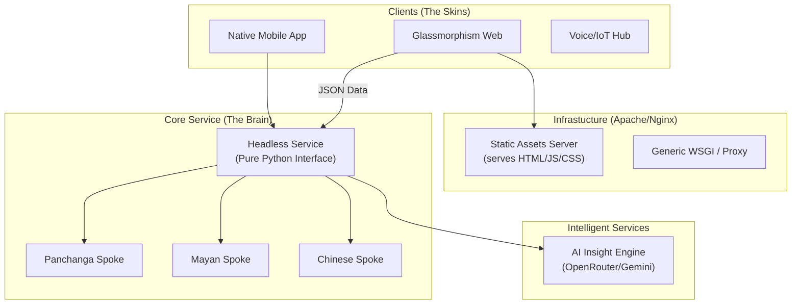

# Master Architecture Specification: Ancient Calendars v2.0
**The Framework-Agnostic, Headless Evolution**

## 1. Executive Summary
The Ancient Calendars project is transitioning from a monolithic Flask-based website to a **Headless Digital Service**. This evolution ensures that the proven astronomical and calendar logic (The "Brain") is decoupled from the web framework and user interface (The "Skin"). This transition enables deployment on generic web servers (like Apache) and support for diverse device factors (Mobile, Watch, Desktop, IoT).

---

## 2. Architectural Philosophy: Why Decouple?

### 2.1 The Case for Framework Independence
Traditionally, the application has been built using Flask. While Flask is excellent for rapid prototyping, it introduces "Framework Coupling." By making the core logic independent, we achieve:
- **Universal Portability**: The same math runs on a Raspberry Pi, Apache, or a Native Android app.
- **Scientific Isolation**: Astronomical calculations are treated as a verified library, not a "web feature."
- **Asset Longevity**: If a web framework becomes obsolete, the ancient calendar logic remains functional.

### 2.2 Flask vs. Generic Web Server (Comparison)

| Feature | Flask (Monolithic) | Generic Hub (Agnostic) |
| :--- | :--- | :--- |
| **Logic Coupling** | Mixed with Web Handles | Completely Isolated Engines |
| **Deployment** | Requires WSGI Container | Apache, Nginx, CGI, or Native |
| **Form Factors** | Responsive Web Only | Mobile App, Watch, Voice, etc. |
| **Testing** | Requires Server Simulation | Pure Python Logic Testing |
| **Updates** | Full Stack Deployment | Backend/UI can update separately |

---

## 3. High-Level Architecture (The Hub & Spoke)

The system is now split into independent domains connected via a standardized JSON interface.



---

## 4. The Standardized JSON Interface
To support various form factors, the Backend must provide a **Stable Contract**. The UI shouldn't care *how* a Tithi is calculated, only *what* the values are.

### Sample Contract:
```json
{
  "metadata": {
    "civilization": "panchanga",
    "version": "2.0",
    "render_hints": ["3d_required", "high_fidelity"]
  },
  "results": {
    "primary": { "tithi": "...", "nakshatra": "..." },
    "astronomy": { "moon_long": 124.5, "sun_long": 34.2 }
  },
  "education": {
    "maestro_report": "...",
    "audio_summary_url": "..."
  }
}
```

---

## 5. Implementation Roadmap: 3-Phase Approach

### Phase 1: Headless UI & Logic Separation
- **Action**: Transform `app.py` into a pure JSON Gateway.
- **Action**: Extract all remaining UI logic from the Python code.
- **Benefit**: Immediate support for multi-device testing via JSON APIs.

### Phase 2: Generic Server Deployment (Apache)
- **Action**: Eliminate `flask` library dependence from core engines.
- **Action**: Implement a standard WSGI entry point (`gateway.wsgi`).
- **Action**: Configure Apache `mod_wsgi` to handle the Python service directly.

### Phase 3: Configurable AI Infrastructure
- **Action**: Updated `AI_EngineManager` to allow runtime configuration.
- **Action**: Users can toggle between OpenRouter (Default Free), Gemini, or local models.
- **Action**: Maintain "Science-Only" constraints across all models.

---

## 7. Operational & Deployment Guide (Oracle Linux 9 / OCI)

Ancient Calendars v2.0 is designed for high-performance deployment on Oracle Linux 9 using an **Nginx Reverse Proxy + Gunicorn Gateway** stack.

### 7.1 Automated Installation (`setup_fresh.sh`)
The recommended way to deploy a fresh instance on a generic Linux VM:
```bash
# 1. (Optional) Pre-set your keys
export GOOGLE_API_KEY="your_key"
export OPENROUTER_API_KEY="your_key"
export AI_PROVIDER="openrouter" # Selection: gemini | openrouter

# 2. Run the Orchestrator
curl -L https://raw.githubusercontent.com/nanjunda/gregorian_to_ancient_calendars/main/setup_fresh.sh | bash
```
The script automatically handles:
- **Application Relocation**: Moves the app to `/opt/ancient_calendars` for professional isolation.
- **SELinux Hardening**: Configures contexts to allow Nginx network relaying and execution.
- **SSL Generation**: Creates local self-signed certificates for HTTPS on port **58921**.
- **Systemd Integration**: Configures the `ancient_calendars.service`.

### 7.2 Service Management
Once installed, use the standard Linux `systemctl` commands:
- **Restart**: `sudo systemctl restart ancient_calendars`
- **Status**: `sudo systemctl status ancient_calendars`
- **Logs**: `sudo journalctl -u ancient_calendars -f`

---

## 8. AI Engine Configuration (The Mastering Layer)

The AI Engine in v2.0 is modular and provider-agnostic. It uses a **"Double-Spoke" Architecture** to maintain scientific integrity.

### 8.1 Double-Spoke Prompt Architecture
To ensure the AI never drifts into astrology, the instructions are fused at runtime:
1.  **The Foundation (Must-Not-Change)**: Encapsulated in `utils/ai_engine.py`. Contains the "Astro-Tutor" persona, strict science-only guardrails, and markdown formatting rules.
2.  **The Context (Panchanga Spoke)**: Encapsulated in `engines/panchanga/engine.py`. Contains the 3-Phase Scientific Masterclass hierarchy and terminology deconstructions (e.g., resonance cycles, geometric tithis).

### 8.2 Provider Selection & Model Overrides
Configure the engine via these environment variables in your system profile:

| Variable | Description | Options |
| :--- | :--- | :--- |
| `AI_PROVIDER` | Explicitly sets the provider. | `gemini` (Standard), `openrouter` (Default) |
| `AI_MODEL_OVERRIDE` | Forces a specific specific LLM model. | e.g. `google/gemini-2.0-flash-exp:free` |
| `OPENROUTER_API_KEY` | Required for OpenRouter access. | Your API Key |
| `GOOGLE_API_KEY` | Required for Gemini access. | Your API Key |

### 8.3 OpenRouter Fallback Strategy
If OpenRouter is selected, the engine employs an automatic **Cascading Fallback Loop**. If the primary model fails or is busy, it cycles through:
1. `xiaomi/mimo-v2-flash` (Primary)
2. `meta-llama/llama-3.3-70b-instruct:free`
3. `google/gemini-2.0-flash-exp:free`
4. `meta-llama/llama-3.1-405b-instruct:free`
5. `deepseek/deepseek-r1:free`

---

## 9. Verification & Stability: The "Zero Mutation" Principle
Regardless of the architectural shift, the **Panchanga Mathematics and educational prompts must never change.**

1.  **Mathematical Parity**: Every code change is verified by `verify_parity.py` against v1.0 logic.
2.  **Prompt Parity**: The scientific masterclass hierarchy remains identical in content across Phases 1, 2, and 3.
3.  **Stress Testing**: The `stress_test_parity.py` script ensures that high-latitude, DST, and leap-year cases remain 100% identical to the v1.0 proven code.

---
**Last Updated**: January 19, 2026  
> [!TIP]
> **Oracle Linux 9 Deployment Tip**: If environment variables (like `OPENROUTER_API_KEY`) are not being detected by the orchestrator even when using `sudo -E`, it is most reliable to switch to a **Root Shell** first (`sudo -i`), export the variables there, and run the command using **Process Substitution**: `bash <(curl -L [URL])`.
