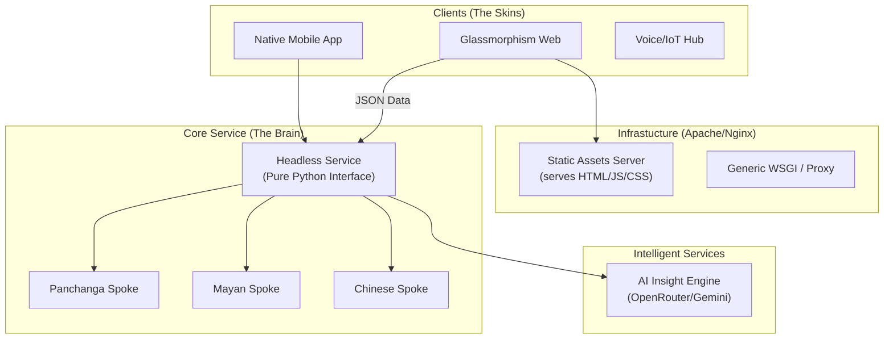

# Master Architecture Specification: Ancient Calendars v2.0
**The Framework-Agnostic, Headless Evolution**

## 1. Executive Summary
The Ancient Calendars project is transitioning from a monolithic Flask-based website to a **Headless Digital Service**. This evolution ensures that the proven astronomical and calendar logic (The "Brain") is decoupled from the web framework and user interface (The "Skin"). This transition enables deployment on generic web servers (like Apache) and support for diverse device factors (Mobile, Watch, Desktop, IoT).

---

## 2. Architectural Philosophy: Why Decouple?

### 2.1 The Case for Framework Independence
Traditionally, the application has been built using Flask. While Flask is excellent for rapid prototyping, it introduces "Framework Coupling." By making the core logic independent, we achieve:
- **Universal Portability**: The same math runs on a Raspberry Pi, Apache, or a Native Android app.
- **Scientific Isolation**: Astronomical calculations are treated as a verified library, not a "web feature."
- **Asset Longevity**: If a web framework becomes obsolete, the ancient calendar logic remains functional.

### 2.2 Flask vs. Generic Web Server (Comparison)

| Feature | Flask (Monolithic) | Generic Hub (Agnostic) |
| :--- | :--- | :--- |
| **Logic Coupling** | Mixed with Web Handles | Completely Isolated Engines |
| **Deployment** | Requires WSGI Container | Apache, Nginx, CGI, or Native |
| **Form Factors** | Responsive Web Only | Mobile App, Watch, Voice, etc. |
| **Testing** | Requires Server Simulation | Pure Python Logic Testing |
| **Updates** | Full Stack Deployment | Backend/UI can update separately |

---

## 3. High-Level Architecture (The Hub & Spoke)

The system is now split into independent domains connected via a standardized JSON interface.



---

## 4. The Standardized JSON Interface
To support various form factors, the Backend must provide a **Stable Contract**. The UI shouldn't care *how* a Tithi is calculated, only *what* the values are.

### Sample Contract:
```json
{
  "metadata": {
    "civilization": "panchanga",
    "version": "2.0",
    "render_hints": ["3d_required", "high_fidelity"]
  },
  "results": {
    "primary": { "tithi": "...", "nakshatra": "..." },
    "astronomy": { "moon_long": 124.5, "sun_long": 34.2 }
  },
  "education": {
    "maestro_report": "...",
    "audio_summary_url": "..."
  }
}
```

---

## 5. Implementation Roadmap: 3-Phase Approach

### Phase 1: Headless UI & Logic Separation
- **Action**: Transform `app.py` into a pure JSON Gateway.
- **Action**: Extract all remaining UI logic from the Python code.
- **Benefit**: Immediate support for multi-device testing via JSON APIs.

### Phase 2: Generic Server Deployment (Apache)
- **Action**: Eliminate `flask` library dependence from core engines.
- **Action**: Implement a standard WSGI entry point (`gateway.wsgi`).
- **Action**: Configure Apache `mod_wsgi` to handle the Python service directly.

### Phase 3: Configurable AI Infrastructure
- **Action**: Updated `AI_EngineManager` to allow runtime configuration.
- **Action**: Users can toggle between OpenRouter (Default Free), Gemini, or local models.
- **Action**: Maintain "Science-Only" constraints across all models.

---

## 6. Verification & Stability: The "Zero Mutation" Principle
Regardless of the architectural shift, the **Panchanga Mathematics must never change.**

1. **Parity Checksums**: Every code move must be verified by `verify_parity.py`.
2. **Stress Testing**: The `stress_test_parity.py` script ensures that high-latitude, DST, and leap-year cases remain 100% identical to the v1.0 proven code.

---
**Standardization Date**: January 19, 2026  
**Status**: 🔵 Design Approved | ⚪ Implementation-Ready
