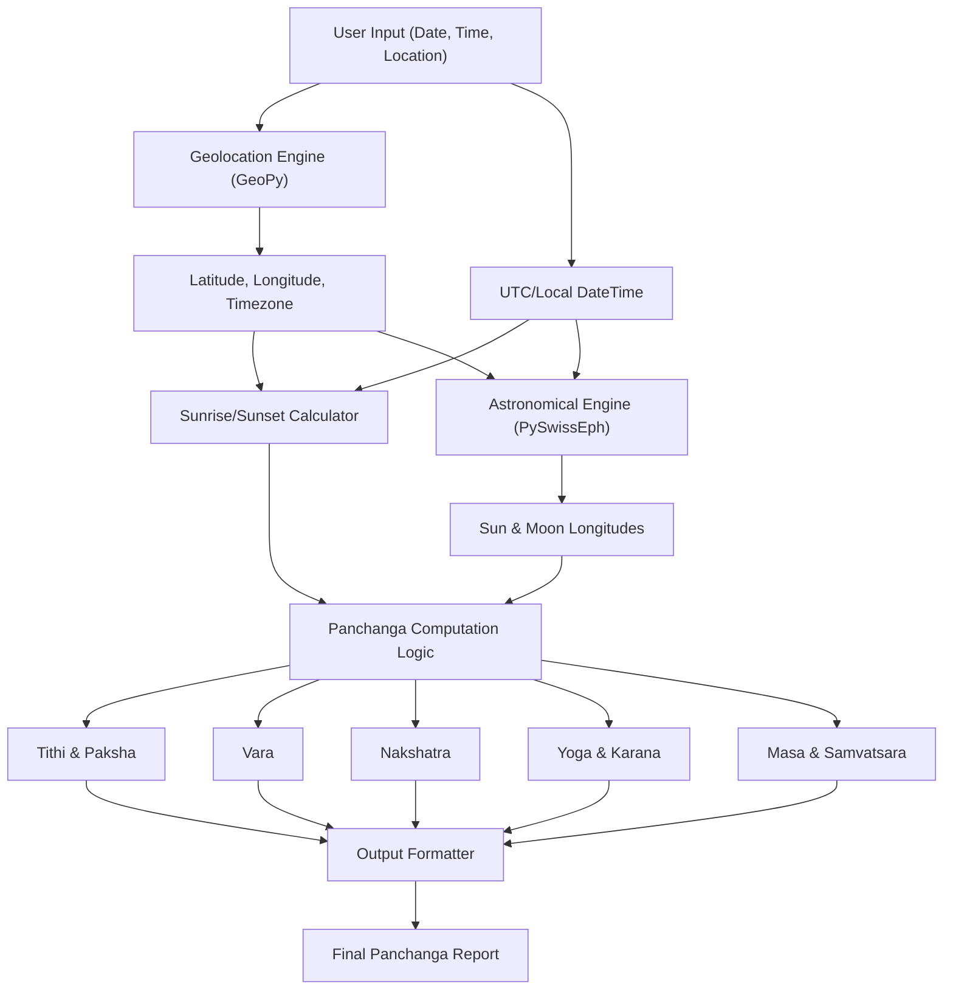

# Architecture: Hindu Panchanga Converter

## Overview
The "Gregorian to Hindu Panchanga Converter" is designed as a modular Python application. It separates data acquisition (ephemeris and geolocation), astronomical computations, and Vedic calendrical logic.

## System Components

## Module Descriptions

### 1. Geolocation Engine
*   **Purpose:** Converts human-readable location strings (e.g., "Bangalore, KA, India") into Geographic Coordinates.
*   **Technology:** `geopy` and `timezonefinder`.

### 2. Astronomical Engine
*   **Purpose:** High-precision computation of planetary positions using the Swiss Ephemeris.
*   **Technology:** `pyswisseph` (Python wrapper for the C-based Swiss Ephemeris).
*   **Key Tasks:** Calculate the Nirayana (Sidereal) longitudes of the Sun and Moon using Lahiri Ayanamsha.

### 3. Panchanga Computation Logic
*   **Tithi:** (Moon Longitude - Sun Longitude) / 12°.
*   **Vara:** Determined based on the day of the week, adjusted for sunrise if necessary (traditional Vedic day starts at sunrise).
*   **Nakshatra:** Moon Longitude / (360° / 27).
*   **Yoga:** (Sun Longitude + Moon Longitude) / (360° / 27).
*   **Karana:** Half of a Tithi (6°).
*   **Masa:** Based on the Sun's entry into Rasis (Sankranti) and the Tithi at the time of New Moon.
*   **Samvatsara:** Determined from the 60-year Jovian cycle.

### 4. Output Formatter
*   **Purpose:** Transforms the raw numerical results into traditional Sanskrit/Hindi names and formats the output for the user.

## Data Flow
1.  **Input:** User provides date/time and location.
2.  **Normalization:** Resolve coordinates and calculate the local sunrise for that specific day.
3.  **Compute:** Calculate the Sidereal longitudes for the target time.
4.  **Derive:** Apply Vedic formulas to the astronomical data.
5.  **Present:** Display the results in a readable format.
