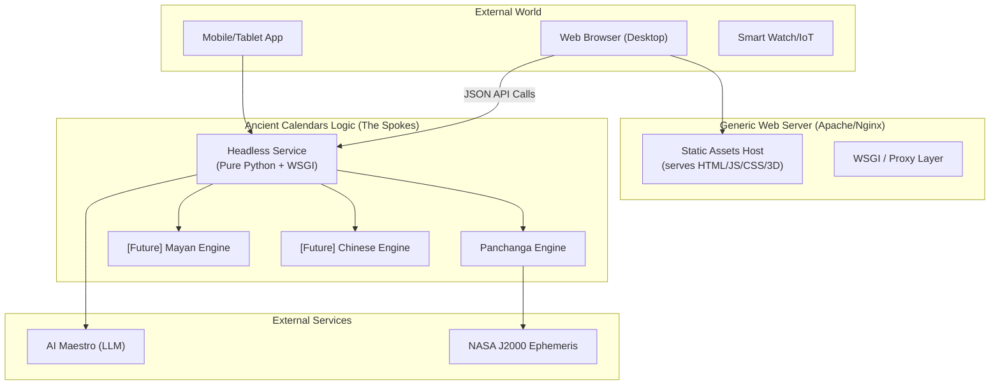
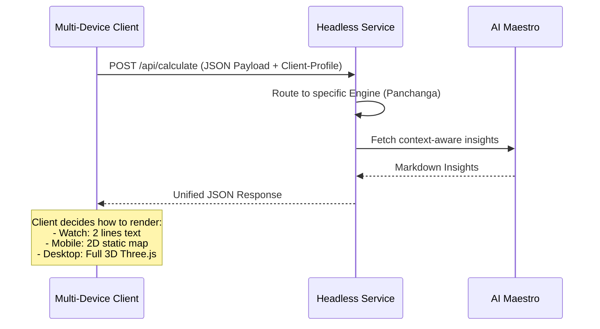

# Architecture Specification: Headless Ancient Calendars (v2.0)

This document outlines the transition to a **Framework-Agnostic Headless Architecture**. We are shifting from a Flask-coupled monolith to a **Logic-First** design that can be deployed on generic web servers (like Apache) and accessed by any device factor.

## 1. Architectural Overview

The system is split into two independent domains:
1.  **The Core Service Layer**: Standardized Python logic that performs calculations and returns JSON.
2.  **The Presentation Client**: Static assets (HTML/JS/CSS) served by a high-performance web server (Apache/Nginx).

### System Relationship Diagram (Mermaid)



---

## 2. Eliminating Framework Dependence (Removing Flask)

To eliminate the Flask dependency while remaining deployable on Apache, we will move toward a **Pure WSGI Interface**.

### How it works:
1.  **Abstract Business Logic**: Your proven astronomical math is already isolated in the `engines/` directory.
2.  **Generic Entry Point**: Instead of `@app.route()`, we create a standard `wsgi_handler(environ, start_response)` function.
3.  **Apache Integration**: Apache's `mod_wsgi` or a proxy to Gunicorn/uWSGI will call this standard Python function directly.

### The Conversion:
- **BEFORE**: `from flask import Flask, jsonify` (Tightly coupled to Flask's internals).
- **AFTER**: `import json`, `from urllib.parse import parse_qs` (Uses standard Python libraries only).

---

## 3. Data Flow & Form Factor Support

To support multiple form factors, we introduce a **Presentation-Aware API**.



### Response Polymorphism
The API will return metadata that helps the UI adapt:
```json
{
  "values": { "tithi": "...", "nakshatra": "..." },
  "visuals": {
     "render_tier": "high", 
     "preferred_canvas": "webgl",
     "audio_summary_url": "..."
  }
}
```

---

## 4. Deployment Model

### Generic Apache Deployment
Apache acts as a single point of entry:
1.  **Port 443 (Static)**: Serves the compiled JS bundle and Glassmorphism index.
2.  **Port 443 (/api path)**: Delegates requests via `ProxyPass` or `WSGIScriptAlias` to the Python service.

### Benefits
- **Zero Framework Bloat**: No dependency on Flask updates or security vulnerabilities.
- **Portability**: Same code runs on a Raspberry Pi, a shared Apache server, or a Native Mobile app.
- **Resource Optimized**: Only calculate what is requested; UI memory usage is entirely on the client-side.

---
**This architecture ensures the "Proven Logic" remains at the core, while the "Frontend" becomes an infinitely swappable skin.**
