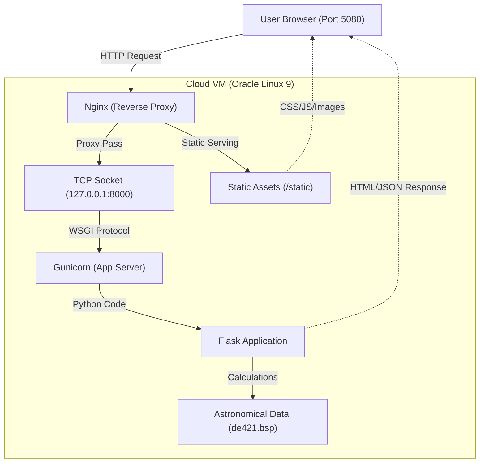

# Walkthrough: Nginx-Enabled Cloud Deployment (Branch: feature/nginx-enable)

This branch enables **Nginx** as a reverse proxy for enhanced security and static file performance.

## Deployment Workflow



## How it works
1. **Nginx** listens on public port **5080**.
2. It serves static files (CSS/JS) directly for speed.
3. It forwards app requests to **Gunicorn** on internal port `8000`.

## Installation
Run these commands on your VM:
```bash
git fetch origin
git checkout feature/nginx-enable
git pull origin feature/nginx-enable
chmod +x deploy.sh
./deploy.sh
```
